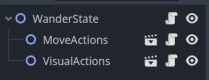
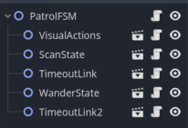

# Overview

The purpose of this document is to both provide a general overview of the AI behaviour system and 
how to use it. Refer to the comments within the code for details pertaining to implementation. 

An AI behaviour is a scene which tells a **Character** what to do and when. A behaviour is formed by 
creating a tree of **State**s in the typical Godot fashion by nesting scenes. 

- A behaviour can simply be a tree of height 1 where the only node is a **State**. This is most 
practical for testing **State**s in isolation before integrating them into a tree.
- A behaviour can be a tree of height 2, where the root node is a **StateMachine**, and the leaves 
are **State**s. This is a FSM (finite state machine)
- Lastly, a tree with a height of at least 3 is a HFSM (hierarchical FSM), where the root and 
non-leaf nodes are **StateMachine**s and the leaf nodes are **State**s.

Why bother with a HFSM over a FSM? Because it enables us to prioritize some **Action**s over others. 
The smaller a node's depth in the behaviour tree (i.e. closer to root), the greater its priority of 
execution. 

## Classes
### State
The leaves of the tree that execute actions as defined by the developer; this typically involves 
manipulating the character which owns the behaviour. It contains an array of **Link**s, which points 
to other **State/StateMachine**s. 

### StateMachine
The non-leaf nodes of the tree that dictate the behaviour of child **StateMachine**s/**State**s 
below it. Only one child of a **StateMachine** is active at a time, but note that a child itself can
also be a **StateMachine**. A **StateMachine** is itself a **State** with all the same functionality.
A **StateMachine** cannot be an ancestor to itself at any tree depth. 

### Link
The "glue" that holds a **StateMachine** together. It points one **State** or **StateMachine** to
 another. Note that **Link**s *typically* link sibling **State/StateMachine**s together, but **Link**s
can *cross **StateMachine** boundaries* - **Link**s can go *up* (to an ancestor), *down* (to a 
descendant), or *accross* (up then down; for example, to a cousin). A **Link** becomes triggered 
once its conditional test has been met, which tells the parent **StateMachine** to change its  
active **StateMachine**/**State**. Only one of these **Links** can be triggered at a time, and are 
triggered in-order. These **State**/**StateMachine** transitions are *atomic*. 

---------------------

# Usage
## Creating New Behaviours
1. Follow the steps for creating a **StateMachine** below, with the exception of naming the scene and script "...Behaviour.[tscn/gd]" to indicate that it is the root node of a behaviour tree.
2. In the parent **Character**.ready(), pass any relevant data to the behaviour that would *normally* be done by the parent **StateMachine**

## Extending Classes
- Add extended classes to the appropriate folder under *res://IntermediateGameObjects/Behaviour/*

### State

1. Create a new 2D scene with the filename "...State.tscn"
2. To the root node, attach a new script that extends **State** with the filename "...State.gd"
3. Add any relevant **Action** scenes as child nodes
4. Override the `on_entry()`, `on_exit()`, and `on_active()` private methods. Use the **Action** nodes here. Return true once the routine is complete. 
	- If you forget to return a `bool`, the routine will run continuously until one of our **Link**s or our parent **StateMachine** tells us to exit. This is the default behaviuor for `on_active()`

### StateMachine

1. OPTIONAL - Draft a [state machine diagram](https://drive.google.com/file/d/1B7M7hS6DAf53DmyjilamFfWFmnEXBJkw/view?usp=sharing). This is especially recommended for complex **StateMachines** like behaviours.
2. Create a new 2D scene with the filename "...FSM.tscn"
3. To the root node, attach a new script that extends **StateMachine** with the filename "...FSM.gd"
4. OPTIONAL - Add any relevant **Action** scenes as children nodes. As above, override `on_entry()`, `on_exit()`, or `on_active()` to use these actions
5. Add any number of **StateMachine** or **State** scenes as child nodes
6. Add any number of **Link**s for each of these **StateMachine** or **States**
7. In the root node's `init_fsm()`, use the **Link**s to connect the child **StateMachine**s/**State**s. Also set the initial state and (optionally) whether the state machine should default to the initial state when exiting.
8. OPTIONAL - Override `update_child_vars()` to pass data to children nodes. By default, this simply copies our instance variables to our children.

### Link
1. OPTIONAL - Add any additional conditional tests (boolean function) in Link.gd
2. Create a new 2D scene with the filename "...Link.tscn"
3. To the root node, attach a new script that extends **Link** with the filename "...Link.gd"
4. Override `is_triggered()`. Use any number of tests in Link.gd before returning a boolean 

### Action
1. OPTIONAL - If your new action does not belong to any preexisting action type, create a new one: 2D scene called "...Actions.tscn" with script "...Actions.gd"
2. Add your action as a function to the appropriate action type class. The return value is ignored.
